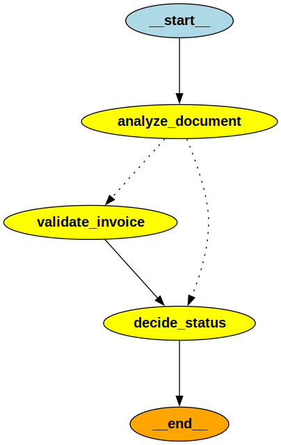
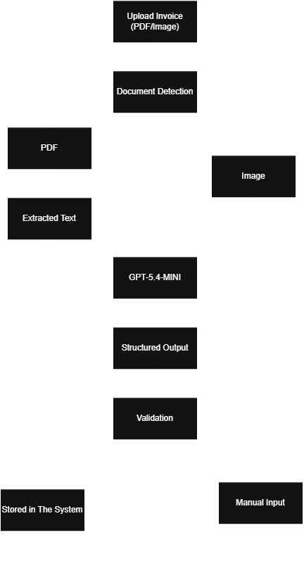

# InvoiceFlow

### AI-Powered Invoice Processing & Review System

InvoiceFlow is an AI-powered japanese invoice processing and review system designed to reduce the manual effort involved in handling invoices. The system accepts invoice documents, extracts structured information using AI, validates the extracted data, identifies potential issues, and presents the results through a web-based review interface. It combines a **React + Vite frontend** with a **FastAPI backend**, an **LLM-powered extraction pipeline**, and **LangGraph-based workflow orchestration**.

---

## 🚀 Overview

Traditional invoice processing often requires accounting staff to manually read invoices and enter information into accounting systems. InvoiceFlow automates this workflow:

```text
Invoice Upload
      ↓
Document Processing
      ↓
AI-Powered Data Extraction
      ↓
Structured Invoice Data
      ↓
Automated Validation
      ↓
Review & Correction
      ↓
Final Invoice Record
```

The system is designed with a **human-in-the-loop** approach, meaning extracted information can be reviewed and corrected before being considered final.

---

## ✨ Key Features

### 📄 Invoice Upload

Upload japanese invoice documents through the web interface for automated processing. Supported processing is designed around invoice documents such as PDF files and images.

### 🤖 AI Powered Extraction

The backend uses an LLM powered extraction pipeline to convert unstructured invoice content into structured invoice information. The extraction process is designed to:

* Extract vendor information
* Extract invoice numbers and dates
* Extract line items
* Extract quantities and prices
* Extract tax information
* Extract totals

### 🔍 Automated Validation

Extracted invoice data is automatically checked for potential inconsistencies. Validation can include:

* Required field validation
* Amount consistency
* Subtotal and tax calculations
* Total amount verification
* Invoice data consistency
* Missing or suspicious information

### 👨‍💼 Human Review

Invoices can be manually insert after AI processing or validation failed. 

### 📊 Structured Invoice Data

Instead of returning unstructured AI responses, InvoiceFlow converts invoice information into structured data models. This makes the extracted information easier to:

* Validate
* Store
* Display
* Process through APIs
* Integrate with other systems

### 🧠 LangGraph Workflow

The backend uses LangGraph to organize the invoice processing workflow into separate processing stages. This provides a modular architecture where extraction, validation, review, and other processing steps can be maintained independently.



### 📈 LangSmith Observability

LangSmith can be used to trace and monitor the LLM workflow.

This helps with:

* Debugging AI calls
* Monitoring execution
* Inspecting prompts and outputs
* Evaluating extraction behavior
* Identifying workflow failures

---

# 🏗️ Architecture




---

# 🛠️ Technology Stack

## Frontend

| Technology   | Purpose             |
| ------------ | ------------------- |
| React        | User interface      |
| Vite         | Frontend build tool |
| React Router | Application routing |
| Tailwind CSS | Styling             |
| Axios        | API communication   |
| Lucide React | UI icons            |
| Sonner       | Notifications       |

The frontend uses React with Vite and is organized into components, pages, and service modules.

## Backend

| Technology | Purpose                   |
| ---------- | ------------------------- |
| Python     | Backend development       |
| FastAPI    | REST API                  |
| SQLAlchemy | Database ORM              |
| SQLite     | Local database            |
| Pydantic   | Data validation           |
| PyMuPDF    | PDF/document processing   |
| LangChain  | LLM integration           |
| LangGraph  | AI workflow orchestration |
| OpenAI     | LLM-powered extraction    |
| LangSmith  | LLM observability         |

The backend's FastAPI application exposes the invoice API under `/api/invoices`.

---

# ⚙️ Installation

## Prerequisites

Make sure you have the following installed:

* Python 3.12+
* Node.js
* npm
* Git
* OpenAI API key

---

# 🔧 Backend Setup

Navigate to the backend directory:

```bash
cd Backend
```

Create a virtual environment:

### Windows

```bash
python -m venv venv
```

Activate it:

```bash
venv\Scripts\activate
```

### Linux / macOS

```bash
python3 -m venv venv
source venv/bin/activate
```

Install dependencies:

```bash
pip install -r requirements.txt
```

---

## 🔐 Environment Variables

Create a `.env` file inside the `Backend` directory.

Example:

```env
OPENAI_API_KEY=Your_OpenAI_API_Key
OPENAI_MODEL=gpt-model
MAX_FILE_SIZE_MB=20
MIN_EXTRACTED_TEXT_CHARS=100
LANGSMITH_TRACING_V2=true
LANGSMITH_ENDPOINT=https://api.smith.langchain.com
LANGSMITH_API_KEY=Your_Langsmith_API_Key
LANGSMITH_PROJECT=Your_Project_Name
```

Do not commit your `.env` file or API keys to GitHub.

---

# ▶️ Run the Backend

From the `Backend` directory:

```bash
uvicorn app.main:app --reload
```

The API will be available at:

```text
http://127.0.0.1:8000
```

FastAPI documentation:

```text
http://127.0.0.1:8000/docs
```

Health check:

```text
http://127.0.0.1:8000/health
```

The application currently exposes both a root endpoint and a health endpoint, and mounts invoice routes under `/api/invoices`.

---

# 🎨 Frontend Setup

Open another terminal:

```bash
cd Frontend
```

Install dependencies:

```bash
npm install
```

Create a `.env` file inside the `Frontend` directory:

```env
VITE_API_URL=Backend_URL
```

Configure the backend API URL according to the frontend environment configuration.

---

# ▶️ Run the Frontend

```bash
npm run dev
```

The Vite development server will provide the local frontend URL in the terminal.

The frontend project uses Vite and provides the standard `dev`, `build`, `lint`, and `preview` scripts.

---

# 🧩 Backend Design

The backend is separated into multiple logical layers:

```text
API Layer
    ↓
Graph / Workflow Layer
    ↓
Node Layer
    ↓
Service Layer
    ↓
Model / Database Layer
```

This separation makes the system easier to maintain and allows individual parts of the invoice workflow to evolve independently.

---

# 🔌 API

The FastAPI application exposes invoice-related endpoints under:

```text
/api/invoices
```

API documentation can be accessed through:

```text
/docs
```

and:

```text
/redoc
```

when the backend is running.

---

# 🧪 Testing & Evaluation

InvoiceFlow can be evaluated using a collection of representative invoice documents. Recommended evaluation categories include:

### Extraction Accuracy

Measure whether the system correctly extracts:

* Invoice number
* Invoice date
* Vendor
* Line items
* Quantity
* Unit price
* Tax
* Subtotal
* Total

### Validation Accuracy

Evaluate whether the system correctly identifies:

* Missing fields
* Incorrect totals
* Tax inconsistencies
* Invalid values

### Processing Performance

Measure:

* Average processing time
* AI processing time
* PDF processing time
* API response time
* Failure rate

---

# 📊 Observability

LangSmith integration provides visibility into the AI workflow.

It can be used to inspect:

```text
User Request
     ↓
LangGraph Workflow
     ↓
LLM Call
     ↓
Structured Output
     ↓
Validation
     ↓
Final Result
```

This makes it easier to debug prompts, identify extraction failures, and evaluate AI behavior.

---

# 🔒 Security Considerations

Invoice documents may contain sensitive financial information.

Recommended security practices include:

* Never commit API keys
* Never commit production credentials
* Keep `.env` files out of Git
* Validate uploaded files
* Restrict allowed file types
* Limit upload sizes
* Validate AI-generated data before persistence
* Use HTTPS in production
* Apply authentication and authorization before production deployment
* Avoid logging sensitive invoice information unnecessarily

---

# 🚧 Current Limitations

InvoiceFlow is currently intended as an AI-powered invoice processing and review system and may require additional work before production deployment. Potential production improvements include:

* User authentication
* Role-based access control
* Cloud database deployment
* Object/file storage
* Background job processing
* Production logging
* Advanced monitoring
* More extensive invoice format support
* Automated regression testing
* Deployment configuration
* Enterprise security controls

---

# 🔮 Future Improvements

Possible future enhancements include:

* 📧 Email-based invoice ingestion
* 📁 Batch invoice processing
* 🔎 Duplicate invoice detection
* 🧾 More document formats
* 🌍 Multi-language invoice support
* 💱 Multi-currency processing
* 🔗 Accounting software integrations
* 👥 Role-based review workflows
* 📊 Advanced analytics
* 🧠 Improved extraction evaluation
* 🔄 Automated retry mechanisms
* ☁️ Cloud deployment
* 🔐 Enterprise authentication
* 📋 Audit logs

---

# 🎯 Project Goals

InvoiceFlow was designed around one primary goal:

> Reduce the amount of repetitive manual work required to process and review invoices while keeping humans involved in important financial decisions.

The system demonstrates how **LLMs, structured outputs, workflow orchestration, validation, and human review** can be combined into a practical business automation system.

---

# 📄 License

This project is currently intended for educational, evaluation, and demonstration purposes.

Add an appropriate open-source or proprietary license before distributing the project publicly.
